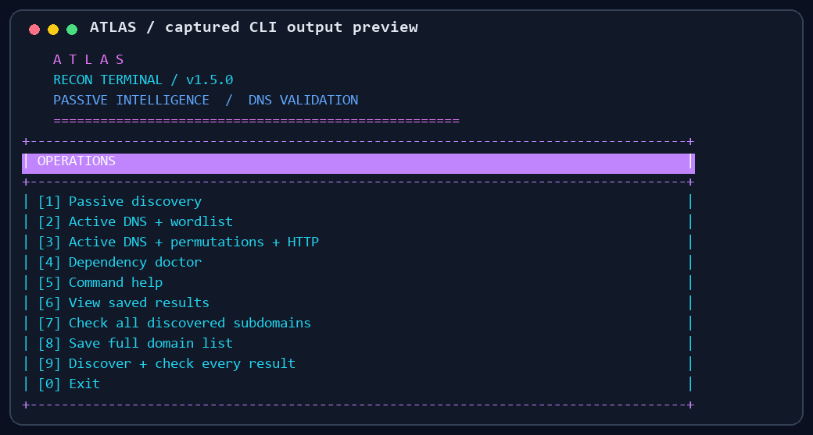
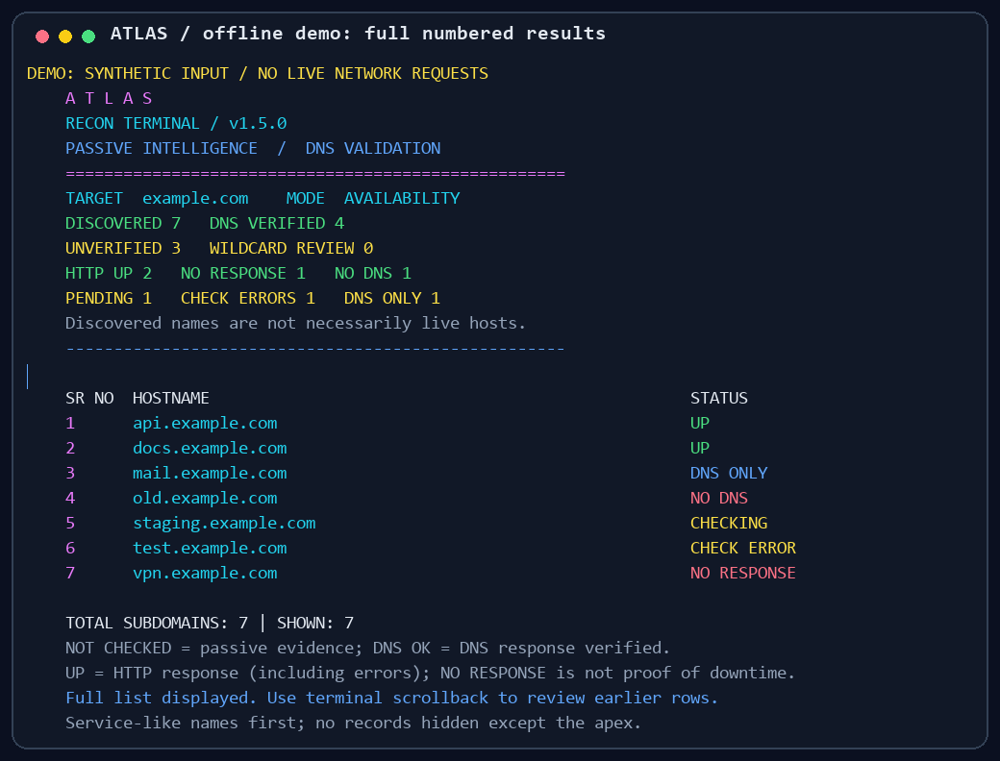

# ATLAS Recon

**Colorful subdomain discovery, DNS reconnaissance and background availability checks—entirely in your terminal.**

[](https://github.com/whitedevil200/atlas-recon/actions/workflows/tests.yml)
[](https://www.python.org/)
[](LICENSE)
[](https://github.com/whitedevil200/atlas-recon/releases)

ATLAS combines public passive sources, optional discovery tools, bounded DNS guesses and DNS/HTTP checks into a scoped inventory. Open the colorful menu, discover names, see the **full numbered list**, check availability, and save results. Built for penetration testers, bug bounty hunters and defenders working on authorized targets.

## Terminal previews





These images render captured output from the actual CLI for documentation; they are **not desktop screen captures**. The results preview uses an explicitly labeled offline fixture, not a live scan of example.com. The real CLI prints every matching name; use terminal scrollback for large lists.

## Features

- Automatic colorful Bash menu on Linux; Python-backed launcher on Windows.
- Passive sources: crt.sh, paginated Cert Spotter, HackerTarget and Wayback CDX.
- Optional Subfinder, Assetfinder and Findomain adapters with source attribution.
- DNS wordlists, bounded one-pass expansion under known names and optional AlterX permutations.
- A/AAAA/CNAME evidence, configurable resolvers, wildcard-suspect classification and optional PureDNS/massdns validation.
- Bounded background DNS/HTTP checks for **every discovered subdomain**, with checkpoints.
- Full numbered results, color-coded statuses, search, refresh and file saving.
- Text/CSV/JSONL exports, raw evidence, timestamps and a man page.

**No tool guarantees finding every subdomain.** Private DNS, unknown labels, archive/certificate coverage, API quotas and exclusions limit results. ATLAS makes no exploit or takeover claims.

## Install on Linux

Requires Python **3.10+**, Bash and Python venv support. Ubuntu/Debian/Kali:

```bash
sudo apt-get update
sudo apt-get install -y git python3 python3-venv figlet
git clone https://github.com/whitedevil200/atlas-recon.git
cd atlas-recon
bash install.sh
export PATH="$HOME/.local/bin:$PATH"
atlas
```

Run `install.sh` without sudo. It creates a local `.venv`, user-local launcher and man page. Keep the repository folder in place: the launcher points to it. Add the PATH export to your shell configuration for future terminals. `figlet` is optional; a colored fallback banner works without it.

Without installing the launcher: `bash atlas` from the repository folder.

## Install on Windows PowerShell

Install Python 3.10+ and Git first:

```powershell
git clone https://github.com/whitedevil200/atlas-recon.git
cd atlas-recon
.\install-windows.cmd
.\atlas.cmd
```

The installer creates `.venv-windows` inside the toolkit. No Bash, WSL, execution-policy change or system PATH modification is needed. PowerShell needs `.\` for programs in the current folder.

To type just `atlas` in the current PowerShell session:

```powershell
$env:Path = "$($PWD.Path);$env:Path"
atlas
```

See [Windows troubleshooting](WINDOWS-QUICKSTART.md). You can fully extract a [release ZIP](https://github.com/whitedevil200/atlas-recon/releases) instead of cloning.

## Menu

| Number | Action |
|---|---|
| 1 | Passive discovery |
| 2 | Active DNS + wordlist |
| 3 | DNS + permutations + optional HTTP metadata |
| 4 | Dependency doctor |
| 5 | Command help |
| 6 | Full numbered results |
| 7 | Check every discovered subdomain |
| 8 | Save all names |
| 9 | Discover + background availability checks |
| 0 | Exit |

Colors are enabled by default in the launcher. `NO_COLOR=1 atlas` disables them on Linux. Explicit control: `atlas --color always COMMAND` or `atlas --color never COMMAND`. Direct `python3 atlas.py` also opens a menu.

## Discover and check

On PowerShell replace `atlas` below with `.\atlas.cmd`. Active checks require authorized scope.

```bash
# Passive discovery
atlas scan -d example.com

# Discovery followed by checks of every discovered name
atlas scan -d example.com --check-live --authorized --workers 8 --rate 10

# DNS wordlist discovery
atlas scan -d example.com --mode active --authorized -w words.txt

# Bounded expansion and optional permutations
atlas scan -d example.com --mode active --authorized --permute \
  --recursive-depth 1 --max-candidates 10000 --exclude vendor.example.com

# Offline evidence import; no network requests in passive mode
atlas scan -d example.com --offline --import evidence.txt

# Select passive providers and bound CT pages
atlas scan -d example.com --sources certspotter,hackertarget --ct-pages 5
```

The scan prints its saved directory. Replace the placeholders below with that **actual folder path**.

```bash
# Full list is automatic: no pagination or --all needed
atlas report results/RUN_FOLDER
atlas browse results/RUN_FOLDER
atlas report results/RUN_FOLDER --find api --details

# Check an existing list; original discovery is preserved
atlas check results/RUN_FOLDER --authorized --timeout 5 --workers 8
atlas check results/RUN_FOLDER --authorized --dns-only
```

The viewer supports **r** refresh, **s** search, **w** save and **q** exit. All matching names appear immediately with serial numbers.

## Save files

```bash
atlas export results/RUN_FOLDER -o domains.txt
atlas export results/CHECKED_FOLDER -o status.csv --format csv
atlas export results/CHECKED_FOLDER -o evidence.jsonl --format jsonl
atlas export results/CHECKED_FOLDER -o up.txt --availability UP
```

CSV includes serial numbers. Plain text exports keep one hostname per line for use in other tools. Existing files are preserved unless `--force` is explicit.

## Understand the status

| Label | Meaning |
|---|---|
| **UP** / green | HTTP/HTTPS responded, including redirects and 4xx/5xx errors. Not a claim the application is healthy. |
| **NO RESPONSE** / red | DNS addresses exist but neither HTTPS nor HTTP responded during checks. Not proof of downtime. |
| **NO DNS** / red | No usable A/AAAA address was returned. |
| **DNS ONLY** / blue | DNS addresses found; HTTP was not checked. |
| **CHECK ERROR** / yellow | A query/worker error prevented reliable assessment. |
| **CHECKING** / yellow | Pending result, including in interrupted runs. |
| **NOT CHECKED** / yellow | Passive evidence without independent availability checks. |
| **REVIEW** / magenta | DNS overlaps random sibling wildcard samples; review manually. |

Availability is timestamped and can change. HTTPS HEAD is tried first, then HTTP on port 80 if needed. Redirects are not followed and TLS validation remains enabled. Other ports and non-web services need separate assessment. Wildcard matching is heuristic.

## Output and limits

| File | Contents |
|---|---|
| `subdomains.txt` | Discovered scoped names, excluding apex |
| `assets.jsonl` | Source, DNS and optional availability evidence |
| `assets.csv` | Discovery inventory |
| `availability.csv` | Numbered availability inventory |
| `up.txt` | Names returning HTTP responses |
| `summary.json` | Counts, stages, settings and completion state |
| `raw/` | Provider responses and external command logs |
| `report.txt` | Readable saved inventory |
| `candidates.txt` | DNS guesses; not proof of discovery |
| `wildcards.json` | Random sibling DNS samples |

Background checks create a separate checked run and preserve completed results on interruption. Open `atlas browse CHECKED_FOLDER` in a second terminal and refresh during checking. Raw discovery evidence stays in the original run referenced by `input_run`.

`--rate` bounds explicit check-operation starts, not internal DNS retries or OS lookups. Passive tools use their own provider pacing. Cert Spotter pages are capped by `--ct-pages`; `--ct-after` continues from a saved issuance ID. HackerTarget free responses are capped at 50 hosts. Source failures and missing tools mean reduced coverage.

## Optional external tools

Built-in sources/checks work without these executables. With a recent Go toolchain:

```bash
go install github.com/projectdiscovery/subfinder/v2/cmd/subfinder@latest
go install github.com/tomnomnom/assetfinder@latest
go install github.com/projectdiscovery/alterx/cmd/alterx@latest
go install github.com/d3mondev/puredns/v2@latest
go install github.com/projectdiscovery/httpx/cmd/httpx@latest
export PATH="$(go env GOPATH)/bin:$PATH"
atlas doctor
```

- [Subfinder](https://github.com/projectdiscovery/subfinder): provider keys can broaden coverage.
- [Findomain](https://github.com/Findomain/Findomain): install an official OS/architecture release.
- [PureDNS](https://github.com/d3mondev/puredns): requires [massdns](https://github.com/blechschmidt/massdns) and resolver lists.
- [AlterX](https://github.com/projectdiscovery/alterx): optional permutation generation.
- [ProjectDiscovery httpx](https://github.com/projectdiscovery/httpx): optional active-mode metadata via `--http`; different from Python's httpx package.

Upstream flags/runtime requirements can change. Pin reviewed release tags for reproducible use. External code is invoked separately, not bundled or relicensed.

## Help, tests and troubleshooting

```bash
atlas --help
atlas scan --help
atlas check --help
atlas doctor
man -l man/atlas.1
python3 -m unittest discover -s tests -v
bash -n atlas install.sh
```

PowerShell command not recognized? Use `.\atlas.cmd` in the extracted folder. Missing DNS module? Rerun your platform installer. Provider HTTP 429/502/timeouts mean source failure, not necessarily a startup failure.

Exit codes: **0** command completed, **1** discovery stage failure, **2** input/configuration error, **130** interrupted. Completed checks may still contain per-host CHECK ERROR records; read the counts.

[Research notes](RESEARCH.md) · [Validation notes](VALIDATION.md). CI uses offline fixtures/mocks and does not scan public targets.

## License and contributions

[MIT](LICENSE) applies to ATLAS's original code. External tools/services retain their own licenses and terms. Bug reports and focused pull requests are welcome; include your OS, command, version and sanitized error output.
